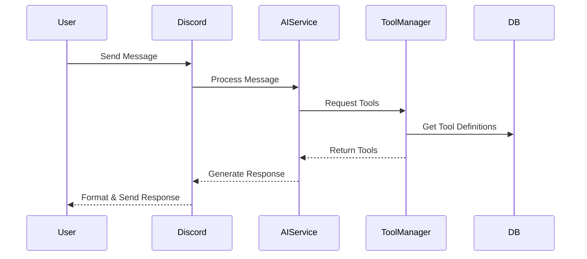
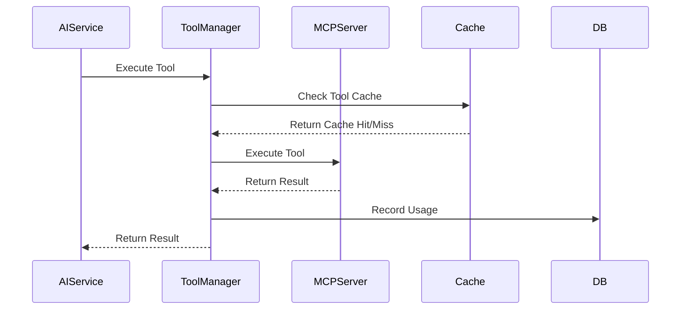

# MCP Architecture Documentation

## System Overview

The MCP (Multi-Component Protocol) system is designed as a modular, layered architecture that facilitates AI-powered interactions across multiple interfaces while maintaining clean separation of concerns and high extensibility.

## Architecture Layers

### 1. Client Layer
Handles external interactions and user interfaces.

#### Components:
- **Discord Bot**: Primary interface for Discord interactions
- **CLI Interface**: Command-line interface for local interactions
- **Web API**: REST API for web-based interactions

#### Responsibilities:
- User session management
- Command routing
- Message handling
- Event dispatching
- Interface-specific formatting

### 2. Service Layer
Orchestrates business logic and coordinates between components.

#### Components:

##### AIServiceFactory
```typescript
interface AIServiceFactory {
  initialize(config: MCPConfig): void;
  create(model: string): AIService;
  cleanup(): void;
}
```
Responsibilities:
- AI service instantiation
- Configuration management
- Resource lifecycle management

##### MCPServerManager
```typescript
interface MCPServerManager {
  startServer(id: string, config: MCPServerConfig): Promise<void>;
  stopServer(id: string): Promise<void>;
  getToolManager(): ToolManager;
  getServerState(id: string): ServerState;
}
```
Responsibilities:
- Server lifecycle management
- Tool management coordination
- State management
- Error handling

##### ServiceRegistry
```typescript
interface ServiceRegistry {
  getAIFactory(): AIServiceFactory;
  getMCPManager(): MCPServerManager;
  getDatabase(): DatabaseService;
  getCache(): CacheService;
}
```
Responsibilities:
- Service discovery
- Dependency injection
- Configuration management

### 3. Core Layer
Contains core business logic and AI service implementations.

#### Components:

##### BaseAIService
```typescript
abstract class BaseAIService {
  protected toolManager: ToolManager;
  protected promptGenerator: SystemPromptGenerator;
  
  abstract generateResponse(message: string, history?: AIMessage[]): Promise<AIResponse>;
  abstract getModel(): string;
}
```

##### ToolManager
```typescript
interface ToolManager {
  getAvailableTools(): Promise<ToolDefinition[]>;
  executeTool(name: string, args: any): Promise<ToolResponse>;
  refreshToolInformation(): Promise<void>;
}
```

##### SystemPromptGenerator
```typescript
interface SystemPromptGenerator {
  generatePrompt(): Promise<string>;
  updateContext(context: PromptContext): void;
  getToolDescriptions(): string;
}
```

### 4. Infrastructure Layer
Handles data persistence, caching, and cross-cutting concerns.

#### Components:

##### DatabaseService
```typescript
interface DatabaseService {
  // Conversation Management
  createConversation(model: string, context?: MessageContext): Promise<number>;
  getConversation(id: number): Promise<Conversation>;
  addMessage(conversationId: number, content: string, role: MessageRole): Promise<void>;
  
  // Tool Management
  registerTool(definition: ToolDefinition): Promise<void>;
  getToolDefinitions(): Promise<ToolDefinition[]>;
  
  // Metrics
  recordToolUsage(toolId: string, usage: ToolUsage): Promise<void>;
  getMetrics(): Promise<SystemMetrics>;
}
```

##### CacheService
```typescript
interface CacheService {
  get<T>(key: string): Promise<T | null>;
  set<T>(key: string, value: T, ttl?: number): Promise<void>;
  invalidate(pattern: string): Promise<void>;
  getMetrics(key: string): Promise<CacheMetrics>;
}
```

##### EventEmitter
```typescript
interface EventEmitter {
  emit(event: string, data: any): void;
  on(event: string, handler: (data: any) => void): void;
  off(event: string, handler: (data: any) => void): void;
}
```

## Data Flow

1. **User Interaction Flow**


2. **Tool Execution Flow**


## Configuration Management

### Environment Configuration
```typescript
interface EnvironmentConfig {
  NODE_ENV: 'development' | 'production' | 'test';
  LOG_LEVEL: 'debug' | 'info' | 'warn' | 'error';
  API_KEYS: Record<string, string>;
}
```

### Service Configuration
```typescript
interface ServiceConfig {
  ai: {
    defaultModel: string;
    maxRetries: number;
    timeout: number;
  };
  mcp: {
    serverConfig: MCPServerConfig;
    toolsConfig: ToolsConfig;
  };
  cache: {
    ttl: number;
    strategy: 'memory' | 'redis' | 'file';
  };
}
```

## Error Handling

### Error Hierarchy
```typescript
class MCPError extends Error {
  constructor(
    message: string,
    public type: ErrorType,
    public metadata?: Record<string, any>
  ) {
    super(message);
  }
}

enum ErrorType {
  INITIALIZATION_ERROR = 'INITIALIZATION_ERROR',
  API_ERROR = 'API_ERROR',
  TOOL_EXECUTION_ERROR = 'TOOL_EXECUTION_ERROR',
  VALIDATION_ERROR = 'VALIDATION_ERROR',
  RESOURCE_ERROR = 'RESOURCE_ERROR'
}
```

## Testing Strategy

1. **Unit Tests**
   - Individual component testing
   - Mocked dependencies
   - High coverage requirements

2. **Integration Tests**
   - Service interaction testing
   - Real database connections
   - Tool execution verification

3. **E2E Tests**
   - Full flow testing
   - Multiple interface testing
   - Performance benchmarking

## Security Considerations

1. **Authentication & Authorization**
   - API key management
   - Role-based access control
   - Session management

2. **Data Protection**
   - Sensitive data encryption
   - Cache security
   - Audit logging

3. **Rate Limiting**
   - API call limits
   - Resource usage monitoring
   - DDoS protection

## Monitoring & Metrics

1. **System Metrics**
   - Service health
   - Resource usage
   - Response times

2. **Business Metrics**
   - Tool usage patterns
   - User engagement
   - Error rates

3. **Performance Metrics**
   - Cache hit rates
   - Database performance
   - Network latency

## Future Considerations

1. **Scalability**
   - Horizontal scaling of services
   - Load balancing
   - Distributed caching

2. **Extensibility**
   - Plugin system
   - Custom tool support
   - Interface expansion

3. **Maintenance**
   - Version management
   - Database migrations
   - Configuration updates

## Implementation Details

### 1. Server Management

#### Server Lifecycle
```typescript
// Server states
enum ServerState {
    STOPPED = 'STOPPED',
    STARTING = 'STARTING',
    RUNNING = 'RUNNING',
    ERROR = 'ERROR'
}

// Lifecycle management
class ServerManager implements IServerManager {
    private servers: Map<string, ServerInstance>;
    
    async startServer(id: string, config: ServerConfig): Promise<void> {
        // Server initialization logic
    }
    
    async stopServer(id: string): Promise<void> {
        // Server cleanup logic
    }
}
```

### 2. Tool Management

#### Tool Discovery
```typescript
// Tool definition
interface Tool {
    name: string;
    description: string;
    parameters: Parameter[];
    version?: string;
}

// Tool operations
class ToolManager implements IToolManager {
    async getAvailableTools(): Promise<Tool[]> {
        // Tool discovery logic
    }
    
    async executeToolById(id: string, args: any): Promise<any> {
        // Tool execution logic
    }
}
```

### 3. Error Handling

#### Error Types
```typescript
// Custom error types
class ServerInitializationError extends Error {}
class ToolExecutionError extends Error {}
class ConfigurationError extends Error {}

// Error handling
try {
    await client.executeTool(toolName, args);
} catch (error) {
    if (error instanceof ToolExecutionError) {
        // Handle tool execution error
    } else if (error instanceof ConfigurationError) {
        // Handle configuration error
    }
}
```

## Testing Strategy

### 1. Integration Tests
```typescript
describe('MCP Integration', () => {
    it('should initialize server and execute tools', async () => {
        // Server initialization test
        const server = await manager.startServer(id, config);
        expect(server.state).toBe(ServerState.RUNNING);
        
        // Tool execution test
        const result = await client.executeTool('test_tool', {});
        expect(result.success).toBe(true);
    });
});
```

### 2. Unit Tests
```typescript
describe('Tool Manager', () => {
    it('should validate tool arguments', () => {
        const tool = {
            name: 'test_tool',
            parameters: [
                { name: 'param1', type: 'string', required: true }
            ]
        };
        
        const args = { param1: 'test' };
        expect(toolManager.validateToolArgs(tool, args)).toBe(true);
    });
});
```

## Future Enhancements

### 1. Performance Optimization
- Response caching
- Tool result caching
- Connection pooling
- Request batching

### 2. Monitoring
- Health checks
- Performance metrics
- Usage analytics
- Error tracking

### 3. Advanced Features
- Pattern recognition
- Automated optimization
- AI-powered insights
- Advanced error recovery

## Best Practices

### 1. Code Organization
- Clear separation of concerns
- Interface-driven development
- Dependency injection
- Error handling

### 2. Testing
- Comprehensive test coverage
- Integration testing
- Unit testing
- Performance testing

### 3. Documentation
- Code documentation
- API documentation
- Architecture documentation
- Troubleshooting guide 