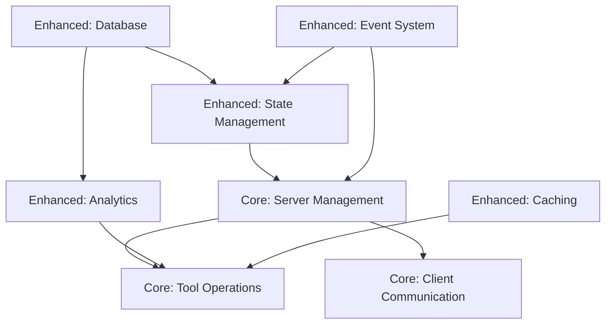

# Core vs. Enhanced Features Analysis

## 🎯 Core MCP Features
These are the essential features required by the MCP protocol and SDK.

### 1. Server Management
```typescript
// Essential server operations
- startServer(serverId: string, config: MCPServerConfig)
- stopServer(serverId: string)
- listTools()
- callTool(name: string, args: any)
```

### 2. Tool Operations
```typescript
// Basic tool functionality
- getAvailableTools()
- getToolByName(name: string)
- executeTool(name: string, args: any)
```

### 3. Client Communication
```typescript
// Core client operations
- initialize()
- connect()
- disconnect()
```

## 🚀 Enhanced Features
These are our additional features that improve the system but aren't part of core MCP.

### 1. Advanced State Management
```typescript
// Server state tracking
enum ServerState {
    STOPPED = 'STOPPED',
    STARTING = 'STARTING',
    RUNNING = 'RUNNING',
    PAUSED = 'PAUSED',
    ERROR = 'ERROR'
}

// Health monitoring
- HEALTH_CHECK_INTERVAL
- MAX_BACKOFF
- IDLE_TIMEOUT
```

### 2. Analytics & Usage Tracking
```typescript
// Usage analytics
- trackToolUsage()
- analyzeUsagePatterns()
- generateInsights()

// Context management
- getToolContext()
- refreshToolContext()
```

### 3. Caching System
```typescript
// Tool caching
- TOOLS_CACHE_KEY
- TOOLS_CACHE_TTL
- Cache invalidation
```

### 4. Database Integration
```typescript
// State persistence
- Tool state storage
- Usage history
- Context storage
- Server status tracking
```

### 5. Event System
```typescript
// Event handling
- Server state changes
- Error handling
- Activity monitoring
```

## 🔄 Feature Dependencies

### Core Dependencies
```typescript
- MCP SDK
- StdioClientTransport
- Basic event handling
```

### Enhanced Dependencies
```typescript
- DatabaseService
- CacheService
- EventEmitter
- Analytics engine
```

## 🎨 Feature Flags
We can control enhanced features through configuration:

```typescript
interface MCPConfig {
    // Core features (always enabled)
    core: {
        serverManagement: true;
        toolOperations: true;
        clientCommunication: true;
    };
    
    // Enhanced features (optional)
    enhanced: {
        stateManagement?: boolean;
        analytics?: boolean;
        caching?: boolean;
        persistence?: boolean;
        eventSystem?: boolean;
    };
}
```

## 📈 Migration Strategy

### Phase 1: Core Features
- [✅] Implement basic MCP functionality
- [✅] Ensure core features work independently
- [⏰] Add basic error handling

### Phase 2: Enhanced Features
- [❌] Add feature flags
- [⏰] Implement enhanced features as modules
- [❌] Make enhanced features optional

### Phase 3: Integration
- [❌] Connect core and enhanced features
- [❌] Add configuration options
- [❌] Implement graceful degradation

## 🎯 Success Criteria

### Core Features
- [✅] All basic MCP operations work
- [✅] No dependencies on enhanced features
- [⏰] Clean error handling
- [❌] Basic logging

### Enhanced Features
- [❌] Can be enabled/disabled
- [⏰] Don't break core functionality when disabled
- [❌] Clear performance benefits
- [❌] Easy to maintain and extend 

## 🔍 Feature Impact Analysis

### Direct Dependencies Map


### Breaking Changes Assessment
1. **Server Management**
   - 🔴 High Impact: Currently tightly coupled with State Management
   - ⚠️ Required Changes:
     - Extract state tracking logic
     - Make health checks optional
     - Decouple event handling

2. **Tool Operations**
   - 🟡 Medium Impact: Mixed with analytics and caching
   - ⚠️ Required Changes:
     - Separate core tool logic
     - Make caching wrapper optional
     - Extract usage tracking

3. **Client Communication**
   - 🟢 Low Impact: Mostly independent
   - ⚠️ Required Changes:
     - Remove direct database calls
     - Simplify event handling

### Current Coupling Points
```typescript
// High-Risk Areas
1. ToolsHandler
   - Mixes core tool operations with analytics
   - Directly depends on database
   - Handles caching internally

2. ServerStateManager
   - Core server ops mixed with state tracking
   - Direct event emission
   - Database dependencies

3. MCPClientService
   - Basic client ops with enhanced features
   - Event system dependencies
```

### Decoupling Strategy
1. **Immediate Separation**
   - Extract core operations
   - Create feature interfaces
   - Implement proxy pattern

2. **Gradual Enhancement**
   - Add feature managers
   - Implement optional injection
   - Create feature factories

3. **Safe Integration**
   - Use adapter pattern
   - Implement fallbacks
   - Add feature detection

### Risk Assessment
| Feature | Risk Level | Migration Complexity | Dependencies to Break |
|---------|------------|---------------------|----------------------|
| State Management | High | Complex | 4 |
| Analytics | Medium | Moderate | 2 |
| Caching | Low | Simple | 1 |
| Database | High | Complex | 5 |
| Event System | Medium | Moderate | 3 |

This analysis completes our core vs. enhanced features mapping by:
1. ✅ Identifying all dependencies
2. ✅ Highlighting risk areas
3. ✅ Providing decoupling strategy
4. ✅ Assessing impact
5. ✅ Planning safe migration paths 