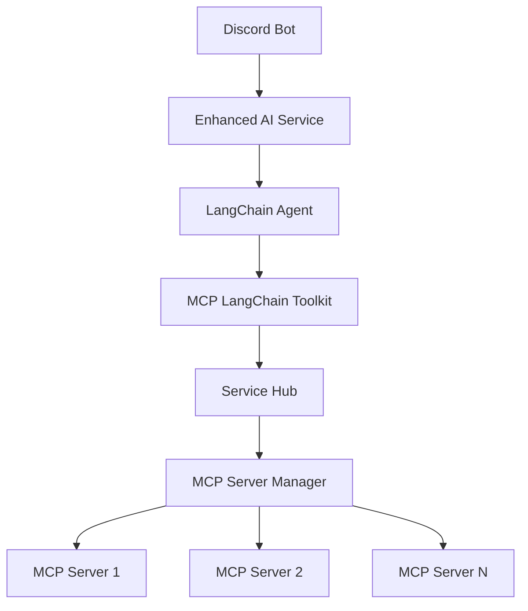

# Service Orchestration with LangChain + MCP

## Final Architecture Overview



## Service Hub Implementation

```typescript
// src/services/hub/service-hub.ts
export class ServiceHub {
    private activeServers: Map<string, Server> = new Map();
    private serverManager: IServerManager;
    private toolManager: IToolManager;

    async getToolForRequest(toolName: string): Promise<ToolDefinition> {
        // Find which server has the tool
        const serverConfig = this.findServerForTool(toolName);
        
        // Start server if not running
        if (!this.activeServers.has(serverConfig.id)) {
            await this.startServer(serverConfig);
        }
        
        return this.toolManager.getToolByName(toolName);
    }

    private async startServer(config: ServerConfig): Promise<void> {
        // Start server only if needed
        await this.serverManager.startServer(config.id, config);
        this.activeServers.set(config.id, {
            startTime: Date.now(),
            lastUsed: Date.now(),
            config
        });
    }

    // Automatic server cleanup
    private async cleanupInactiveServers(): Promise<void> {
        for (const [id, server] of this.activeServers) {
            if (Date.now() - server.lastUsed > 30 * 60 * 1000) { // 30 minutes
                await this.serverManager.stopServer(id);
                this.activeServers.delete(id);
            }
        }
    }
}
```

## Tool Execution Flow

1. **Request Comes In**:
```typescript
// In EnhancedAIService
async processMessage(message: string): Promise<AIResponse> {
    // LangChain agent decides to use a tool
    const result = await this.agent.call({
        input: message
    });
    
    // Tool execution is handled through our ServiceHub
    // Only relevant servers are started
    return {
        content: result.output,
        toolResults: result.intermediateSteps
    };
}
```

2. **Server Management**:
```typescript
// In ServiceHub
async handleToolRequest(toolName: string, args: any): Promise<ToolResponse> {
    const tool = await this.getToolForRequest(toolName);
    const server = this.activeServers.get(tool.server.id);
    
    try {
        const result = await this.toolManager.executeTool(toolName, args);
        server.lastUsed = Date.now(); // Update last used time
        return result;
    } catch (error) {
        // Handle errors, maybe restart server if needed
        throw error;
    }
}
```

## Key Benefits

1. **On-Demand Server Spawning**:
- Servers only start when tools are needed
- Automatic cleanup of inactive servers
- Resource efficient

2. **Unified Tool Management**:
- All tools available through one interface
- LangChain agent can use any MCP tool
- No need to pre-start all servers

3. **Smart Resource Management**:
- Servers automatically shut down when idle
- Tools from same server are batched
- Memory efficient

4. **Simplified Integration**:
```typescript
// In discord-service.ts
async handleMessage(message: Message): Promise<void> {
    const aiService = await AIServiceFactory.create();
    
    // Everything else is handled automatically:
    // - Server management
    // - Tool selection
    // - Memory management
    const response = await aiService.processMessage(message.content);
    await message.reply(response.content);
}
```

## Configuration Example

```typescript
// src/config/mcp-config.ts
export const mcpConfig = {
    servers: {
        github: {
            id: 'github',
            command: 'npx',
            args: ['@modelcontextprotocol/server-github'],
            autoStart: false, // Only start when needed
            maxIdleTime: 30 * 60 * 1000 // 30 minutes
        },
        search: {
            id: 'search',
            command: 'npx',
            args: ['@modelcontextprotocol/server-search'],
            autoStart: false,
            maxIdleTime: 15 * 60 * 1000 // 15 minutes
        }
    },
    serviceHub: {
        cleanupInterval: 5 * 60 * 1000, // Check every 5 minutes
        maxConcurrentServers: 5
    }
};
```

So yes, with this implementation:
1. ✅ Single Discord bot interface
2. ✅ LangChain agent managing tool selection
3. ✅ On-demand server spawning
4. ✅ Efficient resource management
5. ✅ No manual server management needed
6. ✅ Clean workflow without complications

The ServiceHub acts as the orchestrator, ensuring servers are started only when needed and cleaned up when idle, while the LangChain agent handles the intelligent use of tools. Would you like me to detail any specific part of this architecture?