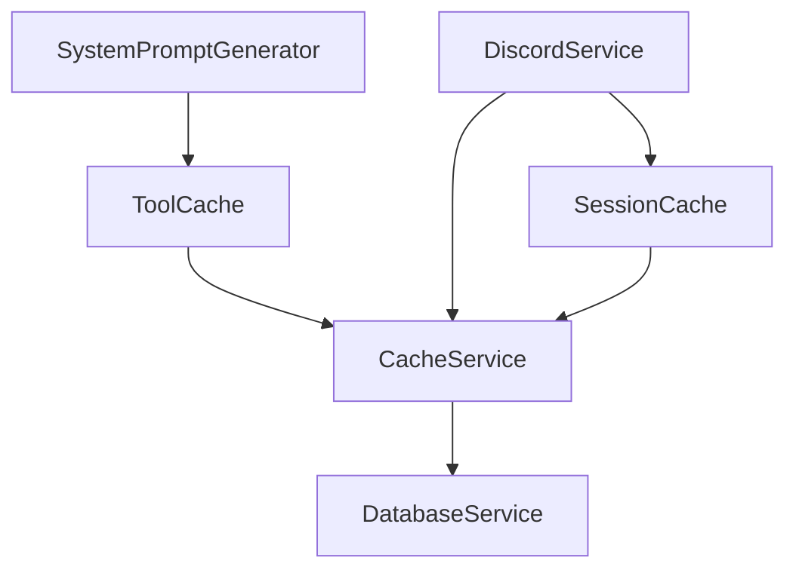

# Services Overview

## Core Services

### Cache Service (`src/services/cache/cache-service.ts`)
- **Purpose**: Core caching functionality
- **Dependencies**: Keyv, KeyvFile
- **Key Features**:
  - Persistent storage
  - Memory caching
  - Metrics tracking
  - Data sanitization

### Database Service (`src/services/db-service.ts`)
- **Purpose**: Database operations
- **Used By**: CacheService, DiscordService
- **Features**:
  - Cache metrics persistence
  - Session storage
  - Data management

### Discord Service (`src/services/discord-service.ts`)
- **Purpose**: Discord interaction handling
- **Dependencies**: SessionCache, CacheService
- **Features**:
  - Message handling
  - Session management
  - Conversation tracking

## Specialized Services

### Tool Cache (`src/services/cache/specialized/tool-cache.ts`)
- **Purpose**: Tool-specific caching
- **Dependencies**: CacheService
- **Features**:
  - Memory monitoring
  - Smart cleanup
  - Multiple cache strategies
  - Performance tracking

### System Prompt Generator (`src/system-prompt-generator.ts`)
- **Purpose**: Generate system prompts
- **Dependencies**: ToolCache
- **Features**:
  - Tool relevance filtering
  - Cached tool lookups
  - Dynamic prompt generation

## Service Relationships



## Configuration

### Cache Configuration
```typescript
interface CacheConfig {
    type: CacheType;
    namespace?: string;
    ttl?: number;
    filename?: string;
}
```

### Tool Cache Configuration
```typescript
interface ToolCacheOptions {
    ttl?: number;
    tags?: string[];
    strategy?: 'replace' | 'increment' | 'max';
}
```

## Service Access Patterns

### Singleton Services
- CacheService
- DatabaseService
- ToolCache
- SessionCache

### Instance Creation
```typescript
// Cache Service
const cache = CacheService.getInstance({
    type: CacheType.PERSISTENT,
    namespace: 'my-cache'
});

// Tool Cache
const toolCache = ToolCache.getInstance();
```

## Error Handling

Each service implements its own error handling:
- CacheService → CacheError
- DatabaseService → DBError
- DiscordService → DiscordError

## Metrics & Monitoring

### Cache Metrics
- Hit/Miss rates
- Memory usage
- Response times
- Error counts

### Service Health
- Automatic monitoring
- Performance logging
- Error tracking

## Best Practices

1. **Service Access**:
   - Always use getInstance() for singletons
   - Handle service errors appropriately
   - Use proper typing for all operations

2. **Cache Usage**:
   - Use specialized caches when available
   - Set appropriate TTLs
   - Handle cache misses gracefully

3. **Error Handling**:
   - Catch service-specific errors
   - Provide fallback mechanisms
   - Log errors appropriately

## Future Improvements

1. **Service Integration**:
   - Better service discovery
   - Dependency injection
   - Service health monitoring

2. **Performance**:
   - Service worker implementation
   - Better resource management
   - Improved error recovery

3. **Monitoring**:
   - Centralized logging
   - Performance dashboards
   - Alert system 